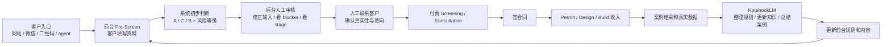

# ADU Screening 业务闭环

## 1. 这个应用到底是做什么的

这个应用不是最终的 ADU 顾问，也不是自动替代人工审批判断的 AI。

它的定位是：

- 前台收集客户信息
- 系统先做初步分级和分流
- 后台人工审核
- 人工联系客户
- 推进到付费 screening / consultation / contract

一句话：

**它是一个获客 + 分诊 + 人工转化的前台工具。**

---

## 2. 当前已成立的业务闭环

### Step 1. 客户进入入口

客户可能来自：

- 网站落地页
- 微信转发
- agent 转发链接
- 二维码
- Google / Yelp / 社群

客户进入公开版 `Pre-Screen` 页面。

---

### Step 2. 客户输入资料

客户在前台填写：

- 地址
- 想做什么
- jurisdiction
- 项目类型
- 结构类型
- blocker 信号
- 联系方式

当前系统支持：

- 引导式问答
- 中英文切换
- 返回上一步
- 联系方式采集
- source / UTM 来源追踪

为了让系统能够真正命中 `policy_notes.yaml` 里的规则，前台问卷至少必须覆盖这些维度：

- 地形状况：是否位于 `hillside`，是否涉及 `basement / below-grade`
- 历史遗留：是否存在 `unpermitted_work`、`addition_without_permit`
- 执法信号：是否收到过 `prior_violation / code enforcement`
- 身份准备度：填写人是否为 `owner on title`
- 路由前提：`jurisdiction` 是否明确
- 目标类型：是 `detached_adu`、`garage_conversion`、`jadu`，还是 `unpermitted_unit`

如果前台没有把这些字段问出来，后台就无法稳定命中规则，也无法形成“问卷收集 -> YAML 规则命中 -> 路由分发 -> 人工介入”的闭环。

---

### Step 3. 系统做初步判断

系统根据规则输出：

- `A` 标准路径
- `C` blocker diagnosis
- `B` rescue / legalization

同时输出：

- `Green / Yellow / Orange / Red`
- 初步建议服务
- 初步 blocker 摘要
- 下一步建议

这一层的作用不是“最终判断”，而是：

- 先筛掉低质量咨询
- 先区分标准单和复杂单
- 让团队知道谁该先跟进

#### Step 3 的 Routing Logic 细化

结合 `policy_notes.yaml`，系统初筛可以按下面的逻辑理解：

- `Path A / Standard`
  - 更接近干净标准路径
  - 最典型的是 `detached_adu`
  - `garage_conversion` 只有在 jurisdiction 明确、records 干净、existing conditions 清晰时，才应暂时留在标准入口

- `Path B / Rescue / Legalization`
  - 一旦命中 `unpermitted_unit`
  - 或已经出现 `prior_violation`
  - 或明显属于既有违建/合法化问题
  - 就应该进入救援型路径，不应按普通 permit path 营销或承诺

- `Path C / Blocker / High Friction`
  - 一旦命中 `hillside`
  - 或 `basement`
  - 或 `unpermitted_work`
  - 或 `addition_without_permit`
  - 或 `garage_conversion` 但现状不清晰
  - 就应进入 blocker diagnosis，而不是继续按最简单标准路径推进

- `低准备度降级`
  - 如果填写人不是产权人
  - 或 `jurisdiction_unknown`
  - 或信息明显缺失
  - 就算物业本身看起来可做，也应先挂起或人工确认，而不是直接强推付费下一步

这套路由逻辑的真正作用是：

- 把“看起来像标准单”的 lead 和“实际高摩擦 lead”区分开
- 避免复杂案件被前台当成简单项目错误承诺
- 让人工时间优先花在最值得推进的线索上

---

### Step 4. 后台人工审核

人工进入 `Lead Inbox` 做这些事：

- 看客户原始输入
- 看系统路径和风险结果
- 修改错误输入
- 重新计算结果
- 删除无效 lead
- 更新 stage / assignee / internal notes

这一层是关键，因为：

- 客户可能填错
- 系统只是初筛，不是最终 permit / legal opinion
- 真正决定要不要推进的是人工

---

### Step 5. 人工联系客户

人工根据客户优先级联系：

- 补问关键问题
- 解释当前结果只是 preliminary
- 判断是否进入下一步

这一步的目标不是免费教育客户，而是：

- 确认项目真实性
- 判断是否值得继续投入时间
- 推到付费 screening 或 consultation

---

### Step 6. 推进到付费服务

如果客户真实且值得推进，就进入：

- paid screening
- deeper records review
- blocker diagnosis
- feasibility / strategy review

再往后，才可能进入：

- permit
- design
- coordination
- build

---

### Step 7. 签合同

当客户认可后，进入正式合同：

- screening agreement
- consultation agreement
- permit / design / build contract

真正的收入在这里开始变大。

---

### Step 8. 项目结果回流

项目推进后，团队会得到新的真实信息：

- 哪类客户最容易成交
- 哪些 blocker 最常出现
- 哪些城市规则最容易误判
- 哪些问题最该在前台先问

这些信息再反过来优化前台应用。

---

## 3. 真正的商业闭环

可以压缩成一句话：

**客户输入资料 -> 系统初步判断 -> 人工审核 -> 人工联系 -> 付费 screening -> 签合同 -> 项目收入 -> 数据回流优化系统**

这就是当前最核心的收入闭环。

---

## 4. NotebookLM 在这个闭环里到底有什么用

NotebookLM 不是前台客服。

它在这个业务里属于：

**后台知识整理与决策辅助层**

### NotebookLM 的 4 个作用

#### 4.1 整理官方文件和规则

把这些资料放进去：

- HCD ADU Handbook
- LADBS 资料
- LA County garage guide
- UDU 流程
- 各城市 playbook
- 你自己的案例笔记

NotebookLM 帮你：

- 总结规则
- 对比城市差异
- 提炼常见 blocker

#### 4.2 帮你更新前台问卷和规则

前台 app 里的：

- intake questions
- blocker rules
- routing logic
- city snippets

不应该全靠你脑子记。

NotebookLM 可以先帮你整理，再由你人工改成系统规则。

#### 4.3 帮人工审核更快

当复杂 lead 进来时，NotebookLM 可以帮助你：

- 对照已有政策资料
- 快速总结可能风险
- 生成内部分析草稿

但最终判断仍然是人工做。

#### 4.4 帮你做内容生产

比如：

- 微信文章
- FAQ
- 城市 landing page 草稿
- 销售话术
- 内部培训资料

---

## 5. 最准确的关系图

---

## 6. 这个应用当前已经具备的闭环部件

根据当前项目文件，已经具备：

- `Pre-Screen` 前台问答
- `Lead Inbox` 后台查看与管理
- `A / C / B` 路由
- 风险等级
- stage / assignee / notes
- 客户输入编辑和删除
- public/admin 视图分离
- admin 密码保护
- webhook 外部同步
- NotebookLM 工作流说明

这说明：

**它已经不是一个纯 demo，而是一个可做小规模真实测试的 intake 工具。**

---

## 7. 还需要持续补强的地方

这一节的目标不是讲战略，而是让团队知道：

- 每条 lead 应该进入哪个状态
- 谁负责
- 多久必须跟进
- 什么情况下推进、挂起、关闭、再营销

### 7.1 Lead Stage 定义表

| Stage | 进入条件 | Owner | SLA | 下一步动作 |
|---|---|---|---|---|
| `new` | 客户刚提交，系统刚生成初步结果 | intake owner / sales coordinator | 4 business hours 内首次查看 | 核对输入完整性，判断是否进入审核 |
| `needs_review` | 信息不完整、系统分流不稳定、blocker 太多 | reviewer / senior sales | 1 business day | 人工修正输入，决定是推进还是挂起 |
| `contacted` | 已完成首次电话/短信/邮件联系 | assigned sales | 24 hours 内更新状态 | 记录客户反馈和下一步 |
| `qualified` | 客户是真实项目，信息基本足够，值得推进 | sales + reviewer | 2 business days 内推进报价 | 推 screening / consultation |
| `screening_booked` | 客户确认进入付费 screening 或 consultation | sales / ops | 付款后 1 business day 内安排 | 发确认、收资料、安排审核 |
| `proposal_sent` | 已发送报价或服务建议 | sales | 3 business days 内跟进 | 促成确认或转 nurture |
| `closed_won` | 已签约或已付款进入正式服务 | ops / PM | 当日更新 | 转项目交付 |
| `closed_lost` | 确认不成交 | sales | 当日更新 | 标记丢单原因 |
| `nurture` | 暂时不做、预算不足、时机未到 | sales / marketing | 30-90 天再触达 | 加入再营销或内容培育 |
| `archived` | spam、重复、无效、永久不跟进 | intake owner | 即时 | 关闭，不再消耗人工 |

### 7.2 异常与流失分支

真实业务里，大量线索不会顺利走到签约，所以必须定义非成交路径。

| 异常状态 | 进入条件 | 处理动作 | 是否再跟进 |
|---|---|---|---|
| `duplicate` | 同一地址、同一邮箱、同一手机号重复提交 | 合并到原 lead，保留最新备注 | 否，除非信息明显更新 |
| `spam` | 明显无关、恶意、测试垃圾数据 | 直接归档 | 否 |
| `no_response` | 首次联系后连续 2-3 次无回应 | 转 `nurture` 或 `closed_lost` | 30 天后可再试一次 |
| `bad_fit` | 不在服务区域、项目类型明显不匹配、需求超出能力边界 | 关闭或转合作方 | 通常否 |
| `budget_mismatch` | 客户预算与最小服务包严重不匹配 | 说明最小服务门槛，转 nurture | 可，后续再触达 |
| `data_incomplete` | 地址不清、权属不明、核心 blocker 未回答 | 退回补资料，状态改 `needs_review` | 是 |
| `future_nurture` | 客户说 3-12 个月后再做 | 转 `nurture`，记录时间点 | 是 |
| `high_risk_external` | 需要 survey、legal、engineering、city confirmation 才能继续 | 升级人工或外部专业方 | 是 |

### 7.3 付费服务 Package 定义

前台不能只写 “paid screening”，要让团队内部清楚每个产品卖什么。

| Package | 适用场景 | 交付内容 | 报价逻辑 |
|---|---|---|---|
| `Basic Screening` | A 类标准路径初筛 | jurisdiction check、初步 records check、blocker list、下一步建议 | 固定低价入口 |
| `Blocker Diagnosis` | C 类卡点诊断 | permit path review、blocker mapping、需要补的资料清单 | 中档定价，按复杂度浮动 |
| `Deep Records Review / Rescue` | B 类救援合法化 | 历史 records 深挖、风险判断、legalization vs rebuild 初步策略 | 高价起步，复杂项目另报价 |
| `Consultation` | 客户要电话/视频详细解读 | 人工讲解当前结果、风险、下一步 | 可单独收费，或抵后续服务费 |
| `Feasibility / Strategy Review` | 客户已准备认真推进 | 更深入的路径评估、时间线和协作建议 | 按项目复杂度报价 |

最低要求：

- 每个 package 必须有明确适用场景
- 每个 package 必须有明确交付物
- 每个 package 必须有最低报价逻辑

### 7.4 执行规则层

#### 7.4.1 人工审核 Checklist

人工审核不能只靠经验，至少要检查下面这些项目：

1. 地址是否完整且可识别。
2. jurisdiction 是否正确。
3. 客户是否是 owner on title，或是否明确是代理提交。
4. 项目类型是否选对。
5. 结构类型是否和目标描述一致。
6. `hillside / basement / addition / unpermitted / violation / prior plans` 是否有明显矛盾。
7. 联系方式是否有效。
8. 客户偏好的联系方式和实际填写是否一致。
9. 系统给出的 `A / C / B` 是否合理。
10. 风险等级是否需要人工上调或下调。
11. 是否需要进入外部专业判断。
12. 是否已经足够推进到付费 package。

#### 7.4.2 Owner 规则

这里定义 “谁在什么条件下做什么”。

- `intake owner`：负责看新 lead、清洗垃圾 lead、处理重复 lead。
- `reviewer`：负责修正输入、核对 blocker、决定是否升级。
- `sales`：负责首次联系、推进付费 screening、报价和签约。
- `ops / PM`：负责已成交客户转交项目执行。

#### 7.4.3 SLA 规则

- `new` lead：4 business hours 内必须被查看。
- `qualified` lead：24 hours 内必须完成首次实质联系。
- `screening_booked`：付款后 1 business day 内必须发确认与资料清单。
- `proposal_sent`：3 business days 内必须至少跟进一次。

#### 7.4.4 升级规则

以下情况必须升级人工或外部专业方：

- jurisdiction 不明确
- 系统结果与客户描述明显冲突
- 有 prior violation / code enforcement
- 涉及 hillside、basement、既有未许可施工
- 需要 legal、survey、engineering、city confirmation

### 7.5 合规与边界层

#### 7.5.1 系统边界说明

本系统输出仅用于：

- preliminary screening
- lead triage
- internal prioritization

本系统输出不能替代：

- 正式 permit review
- legal opinion
- engineering judgment
- site verification
- survey
- city confirmation

任何高风险、信息缺失或规则不明确的案件，都必须进入人工审核或付费专业评估。

#### 7.5.2 前台免责声明标准文案

建议前台始终保留这类话术：

> This result is a preliminary screening only. It is not a permit approval, legal opinion, engineering opinion, or final project determination.

中文版本：

> 本结果仅用于初步预筛，不构成 permit 审批结论、法律意见、工程意见或最终项目判断。

#### 7.5.3 人工联系标准话术边界

人工联系时必须强调：

- 当前结果只是初步判断
- 真正路径要以人工审核、records、现场条件和必要的专业判断为准
- 复杂项目需要进入付费 screening 或更深的 review

#### 7.5.4 销售话术红线

对于系统标记为 `B` 或 `C`，或者命中以下标签的客户：

- `garage_conversion`
- `unpermitted_work`
- `addition_without_permit`
- `prior_violation`
- `hillside`
- `basement`

销售或前台在没有进入付费 screening 前，不应承诺：

- “保证能过”
- “保证能拿 permit”
- “一定能快速审批”
- “这就是简单 ADU 路径”

复杂案件必须先被定义为：

- 需要 records review
- 需要 blocker diagnosis
- 或需要 rescue / legalization strategy

#### 7.5.5 营销分离原则

前台营销和落地页不应把底层逻辑完全不同的项目混成一个入口。

至少应分开这些话术：

- `Detached ADU` vs `JADU`
- `Standard ADU / garage path` vs `UDU / legalization`
- `Clean new project` vs `existing problem rescue`

原因不是文案问题，而是底层审批和 existing-condition 逻辑不同。

#### 7.5.6 必须升级到人工或外部专业方的问题

- 需要明确 legal 解释的问题
- 需要 engineer / survey / architect 盖章或专业判断的问题
- 需要 city confirmation 的问题
- 任何系统无法明确归类的特殊案例

#### 7.5.7 暂不支持自动预判的情形

系统不应承诺自动准确判断下列场景：

- jurisdiction 无法从地址确认
- 项目描述与结构类型明显矛盾
- 涉及复杂 hillside / basement / prior violation
- 需要外部 records 才能继续判断的案件
- 明显超出当前服务区域或能力边界的案件

### 7.6 数据指标板

至少固定看下面这些 KPI：

| 指标 | 说明 |
|---|---|
| Lead 数 | 总体进线量 |
| Contact rate | 有多少 lead 被真正联系到 |
| Qualified rate | 有多少 lead 进入 `qualified` |
| Screening booking rate | 有多少 lead 进入 `screening_booked` |
| Paid conversion rate | 有多少 lead 付费 |
| Win rate | 有多少 lead 最终签约 |
| Source ROI | 哪个来源带来的有效线索和签约最多 |
| Loss reason mix | 丢单主要因为什么 |

### 7.7 数据层持续补强

- 把 webhook 接到 Google Sheets / Airtable / CRM
- 统一记录每次人工联系结果
- 记录未成交原因和 nurture 原因
- 把结果回流到内容和规则库

### 7.8 知识层持续补强

- 城市 playbook 持续更新
- blocker 规则迭代
- 真实案例沉淀回 NotebookLM
- 用真实成交和丢单数据修正前台提问顺序

---

## 8. 核心判断

这个应用最重要的不是“回答所有问题”，而是：

- 先把客户分级
- 先让团队知道谁值得跟进
- 先让人工把高价值单接住

因此最准确的定位是：

**ADU / Garage / Legalization 的前台分诊与人工转化入口**

而 NotebookLM 的最准确定位是：

**内部知识大脑，不是前台销售。**
